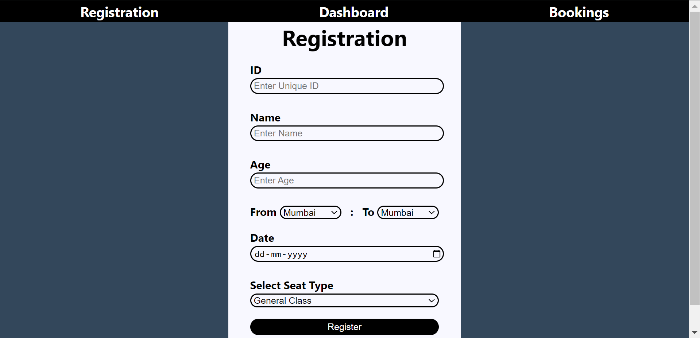
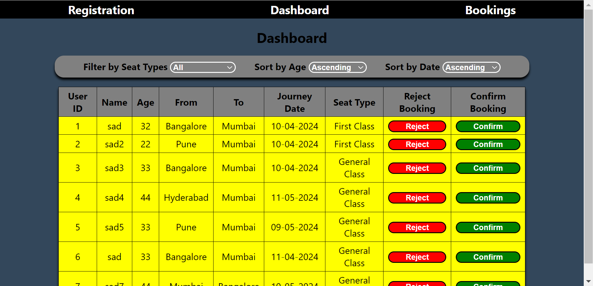
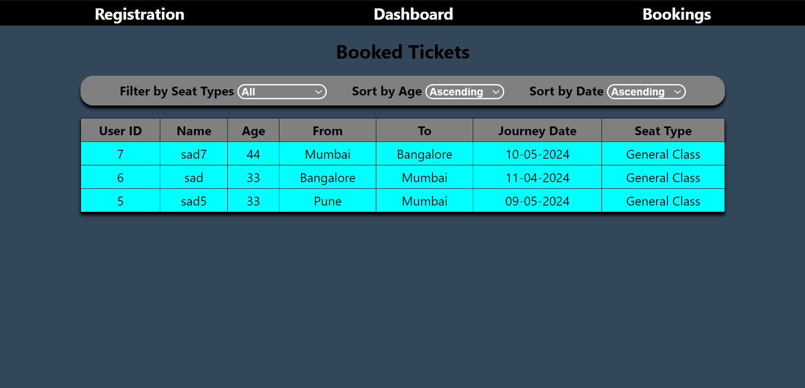

# 🚂Train Ticket Booking System🛤️

## Description

This is a simple **Train Ticket Booking System** web application developed using `HTML`, `CSS`, and `JavaScript`. The application allows user to **Register**, **Book** and **View** their booked tickets, and also _cancel_ or _confirm_ their bookings. Here we have used **LocalStorage** as a database.

## Features

- **User Registration**: _User_ can register by filling the form.
- **Authentication**: To submit form user must pass all the authentications.
- **Train Booking**: _Admin_ can either **Book** or **Cancel** a train ticket for any user. _Admin_ require **OTP** to book tickets.
- Lastly, user can view their booked tickets in the **Booking** section.
- Also, you can **sort** and **filter** tickets according to your needs on both **Dashboard** and **Booked Ticket** page.

## Pages

1. `index`: User registration page.
2. `dashboard`: Dashboard page for managing tickets.
3. `booking`: Dashboard page for showing booked tickets.

## Screenshots

1. **Registration Page**:

2. **Dashboard Page**:

3. **Bookings Page**:

## Technologies Used🧑‍💻

- **Frontend**: `HTML`, `CSS` and `JavaScript`
- **Backend**: `JavaScript`
- **Database**: `LocalStorage` (**P.S**: _We have use localStorage as a database for storing data temporarily._)

